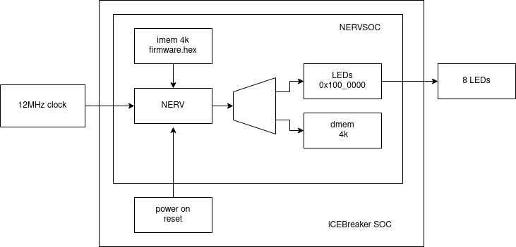

# SOC example for BlackIce-II



# Demo

Counts on the 8 LEDs.

```
make prog
```

# SOC

The SOC instantiates [nervsoc](../../nervsoc.sv).

* [top.v](top.v) Connects clock input and 8 LEDs on the BlackIce-II PMOD 11/12 and provides power on reset
* [sections.lds](sections.lds) sets flash and ram to 4k each.
* [firmware.s](firmware.s) initialises registers, copies data section, initialises bss and starts main
* [firmware.c](firmware.c) flashes the LEDs.
